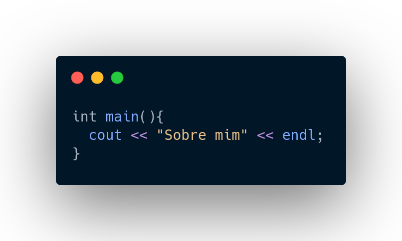
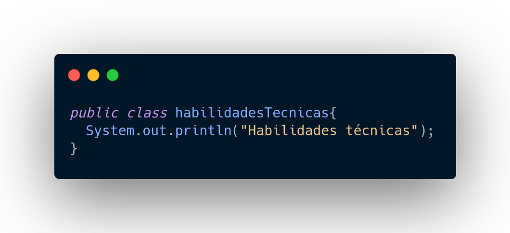
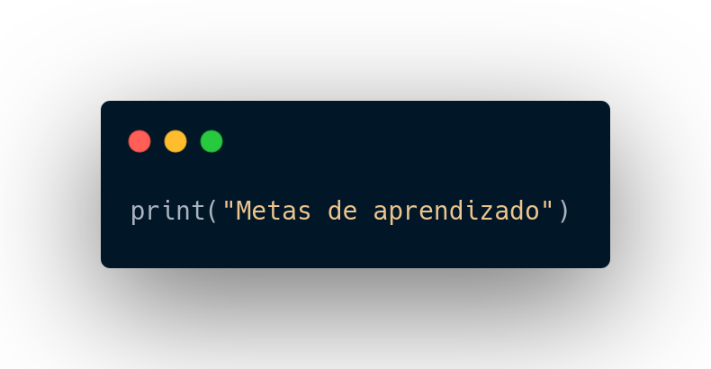

#Oi, o meu nome é ==Victor Graça==.

##Sobre mim:

Bacharelando em Ciência da Computação na Universidade Federal da Bahia e Desenvolvedor Trainee Back-End da [TITAN](https://www.titanci.com.br/), sou apaixonado por tecnologia desde muito jovem e sempre procuro aprender cada vez mais.

##Habilidades técnicas:

###As minhas principais linguagens de programação no momento são:

- Python

- Java

- C++

Além disso, possuo um pouco de conhecimento em HTML, CSS e JavaScript.

##Metas de aprendizado:

###No momento, tenho como metas de aprendizado:

- Melhorar as minhas habilidades em lógica de programação.

- Desenvolver mais projetos de programação. 

- Ter uma base mais sólida tanto em Back-End quanto em Front-End.